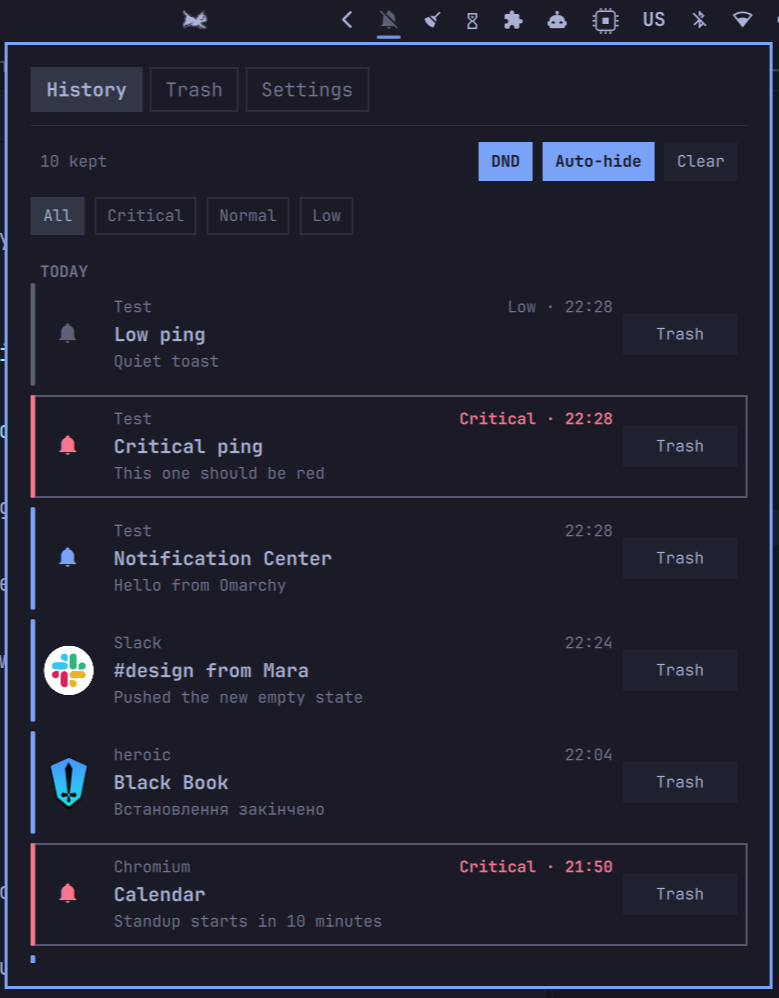

# Yet Another Notification Center

Omarchy bar widget: notification history, trash, sounds, and auto-hide.



Uses Omarchy's `omarchy.notifications` service — leave it enabled. Disable any other notification-center widget first, or you get two bells.

- **History** — search (`/`), urgency chips, DND, auto-hide, dismiss to trash
- **Trash** — restore or empty; keep days from Settings
- **Settings** — General, Sound (Play per clip), Apps

**Tab** cycles tabs · **h/l** chips · **j/k** rows · **Enter** acts · **x** trashes · **Esc** closes

## Install

```sh
omarchy plugin add https://github.com/Loafer19/omarchy-yet-another-notification-center.git --enable
```

## Usage

Click the bell to open the panel. Right-click toggles Do Not Disturb. Escape closes.

## Configure

```sh
omarchy bar move yoyo.notification-center --section right
```

## Remove

```sh
omarchy plugin remove yoyo.notification-center
rm -rf ~/.local/state/omarchy/yoyo.notification-center
```
